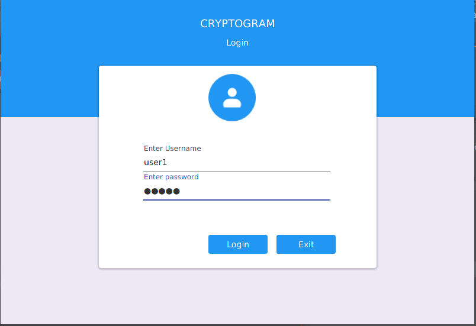
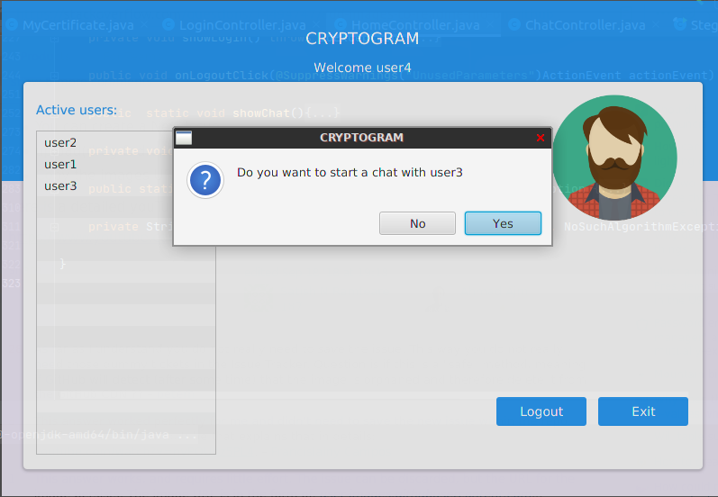
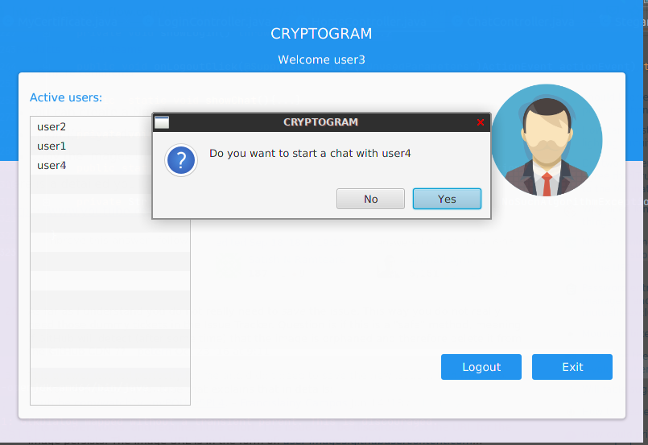
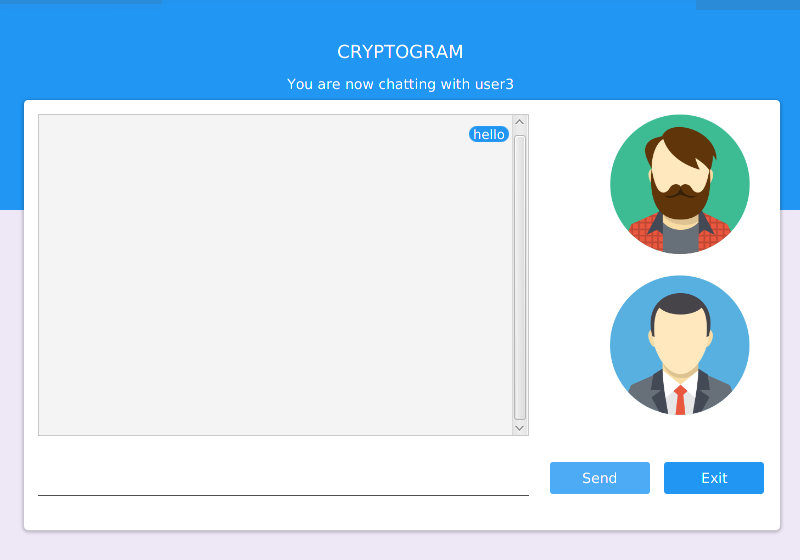
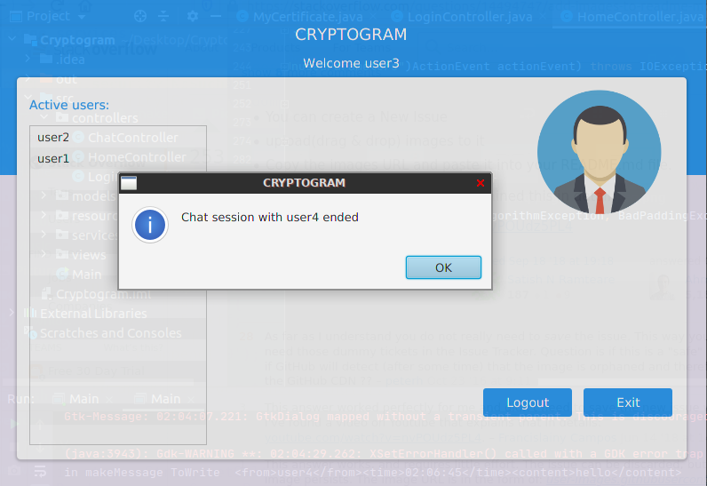

# Cryptogram
Secure chat app

Sipmle java application that recreates secure communication between users. The communicatiion is based on leaving encrypted messages on the file-system.

Running the application user are promted to enter their username and password. Passwords are hashed and salted. SHA-256 is the choosen hashing algorithm.

After login user have the active user list from which he can choose a user who he wants to chat with by double clicling on his name and clicking yes on the send chat request pop-up

After clicking yes user needs to choose a picture in which session key is going to be encoded via steganographic algorithm.
In the first message "Chat session request" there is a path to the encoded image from which the user that recieves it can decode and get a session key if he want to chat.Wheter the user wants to start a chat session or not user is given a pop-up window to choose.

Sending a message is intuitive.

Message first gets encrypted with a symmetric algorithm, than hashed and lastly digitaly signed with private key.
When reading the message on the other end the procces is backward.

Ending a session.

